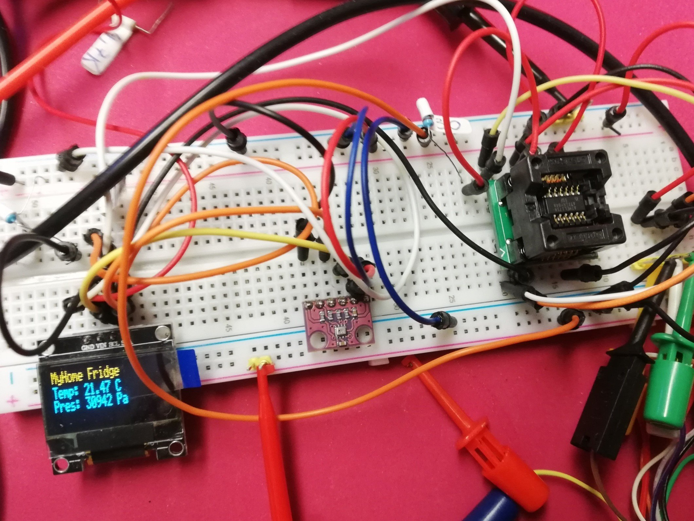

Attiny84 Thermometer
=====================

Push code to attiny84
--------------------------------

### Attiny84
SPI Through BusPirate 
arduino framework 

Tips
----
`pio run` process/build project from the current directory  
`pio run -t upload` - upload firmware to a target  
`pio run -t clean` - clean project (remove compiled files)  
`pio run -t upload -e uno` upload only for arduino uno  

